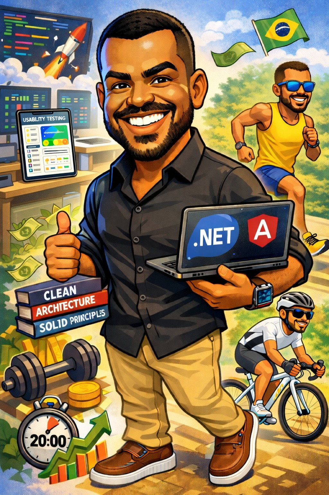

### Hi there 👋

🔭 Currently working on healthcare systems serving thousands of users.
 🌱 Currently learning AI-driven development with Spec Driven Development.
 💬 Ask me about .NET architecture, Clean Code, scalable APIs, SSO implementation, DevSecOps, or how I reduced screen load times by 70%+ 🚀
 ⚡ Fun fact: When I'm not coding, I'm probably debugging thoughts on a bike or a running trail.

  

---

## 🛡️ Core Stack

---

## 🌐 About me

I'm a Senior Software Engineer with 20+ years of experience delivering web solutions for companies across Brazil and global markets, spanning FinTech, HealthTech, HR Tech, Tax & Accounting, and Construction industries.

My core expertise lies in the .NET ecosystem (C#, .NET Core, ASP.NET MVC, Web API), Azure cloud services, and SQL Server - building scalable, secure, and high-quality web applications - with experience in distributed systems, high-availability architecture, automated testing, and DevSecOps.

I'm skilled at translating business requirements into viable solutions and documenting processes and features clearly, ensuring knowledge is accessible across the team. I'm also passionate about sharing knowledge and mentoring colleagues, helping teams grow and stay aligned. Beyond engineering, I volunteer as a technical mentor and instructor, helping professionals transition into or grow within the IT field.

---

## 📊 GitHub Stats

---

## 💻 Stack & Tools

**Backend:** C# · .NET · Web API · ASP.NET MVC · Entity Framework · Dapper

**Cloud & DevOps:** Azure · Azure DevOps · Docker · CI/CD · ELK Stack · DataDog · Serilog

**Frontend:** Angular · JavaScript · TypeScript · Bootstrap · HTML5 · CSS3

**Database:** SQL Server · Redis · MongoDB · PostgreSQL

**Architecture:** Clean Architecture · DDD · SOLID · Microservices · REST APIs

**Testing:** xUnit · Moq · Selenium · FluentAssertions · Bogus

**Methodologies:** Agile · Scrum · Kanban · DevSecOps

---

## 🤖 AI-Assisted Development

GitHub Copilot · Claude Code · Gemini · Spec Driven Development

---

## 💬 Let's Connect

Open to networking, discussions on technology, innovation, and collaboration opportunities.

📧 [contato@lucasbarbosa.com.br](mailto:contato@lucasbarbosa.com.br)
 🔗 [linkedin.com/in/lucasbarbosa](https://linkedin.com/in/lucasbarbosa)
